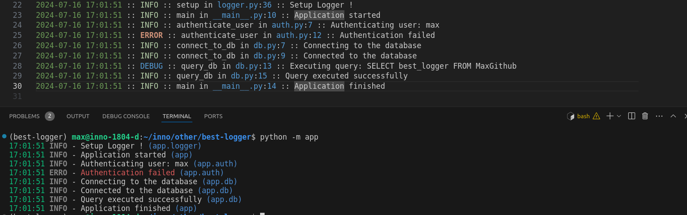

# best-logger
對於我個人來說這是最棒的 log 設定 （隨時調整）



# 使用方法
```bash
python -m venv ./best-logger
source best-logger/bin/activate
pip install -r requirements.txt

python -m app
```

# 筆記
1. **About `StreamHandler`**
   1. Highlight: 使用 `coloredlog` 讓 `stdout` 更鮮明好看。
   2. Current Time: 只紀錄當下時間
   3. Easy to know: 加入 `Module` 更清楚該行為所屬的範圍
2. **About `RotatedFileHandler`** 
   1. Detailed Time: 詳細時間
   2. Full Level Name: 由於編輯器通常具備根據 Level 顯示不同的顏色，故採用完整的名稱 
   3. Easy to debug: 加入 Func, File, Line，讓開發者更容易查找問題， message 反而不是太大的重點
