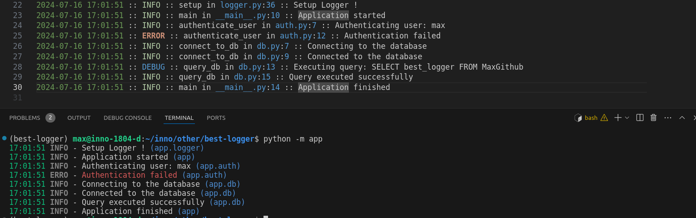

# best-logger
The best setting of the Python logger for myself ([zh](./README-zh-tw.md))



# Usage
```bash
python -m venv ./best-logger
source best-logger/bin/activate
pip install -r requirements.txt

python -m app
```

# Note
1. **About `StreamHandler`**
   1. Highlight: Use `coloredlogs` to enhance the visual appeal of `stdout`.
   2. Current Time: Log only the current time.
   3. Easy to Know: Include `Module` to clearly indicate the scope of the action.

2. **About `RotatingFileHandler`** 
   1. Detailed Time: Record detailed timestamps.
   2. Full Level Name: Utilize the full level name, as most editors can display different colors based on the log level.
   3. Easy to Debug: Include function name, file name, and line number to make it easier for developers to trace issues. The message itself is of lesser importance.
